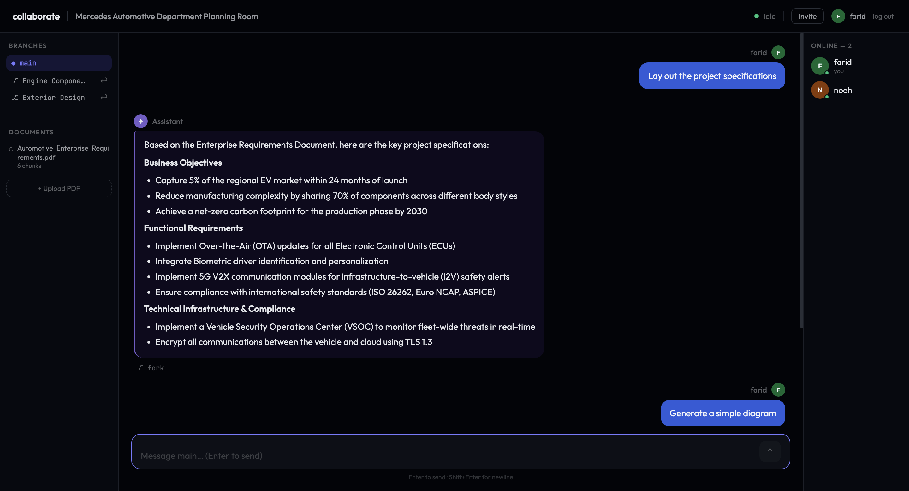

# Collaborate
<div align="center">
  <a href="https://devpost.com/software/behaviourly">
    
  </a>
  <p><i>Click to view the project yourself</i></p>

  [](https://react.dev/)
    [](https://www.typescriptlang.org/)
    [](https://vitejs.dev/)
    [](https://reactrouter.com/)
    [](https://socket.io/)
    [](https://fastapi.tiangolo.com/)
    [](https://www.sqlalchemy.org/)
    [](https://www.sqlite.org/)
    [](https://www.langchain.com/)
    [](https://huggingface.co/)
    [](https://www.docker.com/)
    [](https://render.com/)
    [](https://vercel.com/)
</div>
A multi-user AI-powered planning chatroom where teams brainstorm together with a shared LLM. Upload documents, fork conversation branches, and let the AI generate Mermaid diagrams and concept images — all in real time.

## Features

- **Shared AI assistant** — one LLM responds to the whole room, streamed token-by-token to every connected user
- **Prompt queue** — when the LLM is busy, messages queue up; any team member can approve, edit, or discard before it sends
- **Git-style branching** — fork a private conversation from any message, explore an idea, then merge a summary back into main
- **RAG on your documents** — upload PDFs and the assistant answers using content from them (LangChain + ChromaDB)
- **Mermaid diagrams** — ask for a flowchart, sequence diagram, ER diagram, or class diagram and it renders inline
- **AI image generation** — ask for concept art, logos, or mood boards and an image is generated in the chat
- **User accounts** — register, log in, create rooms, and invite teammates via shareable links
- **Real-time sync** — all messages, branches, and queue actions sync instantly across all tabs via Socket.IO

## Tech Stack

| Layer | Tech |
|-------|------|
| Frontend | React 18, TypeScript, Vite, Socket.IO client |
| Backend | FastAPI, python-socketio, SQLAlchemy, SQLite |
| RAG | LangChain, ChromaDB, `BAAI/bge-small-en-v1.5` (HF Inference API) |
| LLM | Mistral/Llama via HF Inference API |
| Auth | JWT (python-jose), bcrypt |
| Deployment | Render (backend) + Vercel (frontend) |

## Getting Started

### Prerequisites

- Python 3.11+
- Node.js 18+
- A [Hugging Face](https://huggingface.co) account with an API token

### Backend

```bash
cd backend
python -m venv .venv && source .venv/bin/activate
pip install -r requirements.txt

# Create a .env file
cp .env.example .env   # then fill in your HF_TOKEN and SECRET_KEY

uvicorn main:socket_app --reload --port 8080
```

### Frontend

```bash
cd frontend
npm install

# Create a .env.local file
echo "VITE_SOCKET_URL=http://localhost:8080" > .env.local

npm run dev   # http://localhost:5173
```

### Docker (full stack)

```bash
# Copy and fill in your env vars
cp .env.example .env

docker compose up --build
```

Frontend → `http://localhost:5173` · Backend → `http://localhost:8080`

## Environment Variables

### Backend (`.env`)

| Variable | Description | Default |
|----------|-------------|---------|
| `HF_TOKEN` | Hugging Face API token | required |
| `SECRET_KEY` | JWT signing secret | `change-me-in-production` |
| `FRONTEND_URL` | Your frontend URL (used in invite links) | `http://localhost:5173` |
| `CORS_ORIGINS` | Allowed origins (JSON array) | `["http://localhost:5173"]` |
| `DATABASE_URL` | SQLite path | `sqlite+aiosqlite:///./collaborate.db` |

### Frontend (`.env.local`)

| Variable | Description |
|----------|-------------|
| `VITE_SOCKET_URL` | Backend URL | `http://localhost:8080` |

## Deployment

### Render (backend)

1. Create a new **Web Service** pointing to the `backend/` directory
2. Build command: `pip install -r requirements.txt`
3. Start command: `uvicorn main:socket_app --host 0.0.0.0 --port $PORT`
4. Add environment variables: `HF_TOKEN`, `SECRET_KEY`, `FRONTEND_URL`, `CORS_ORIGINS`

### Vercel (frontend)

1. Import the repo and set the **root directory** to `frontend/`
2. Add environment variable: `VITE_SOCKET_URL=https://your-backend.onrender.com`
3. Deploy — `vercel.json` handles SPA routing automatically

## Project Structure

```
├── backend/
│   ├── main.py              # FastAPI app + Socket.IO handlers
│   ├── core/
│   │   ├── auth.py          # JWT + password hashing
│   │   └── config.py        # Environment config
│   ├── models/
│   │   ├── database.py      # SQLAlchemy models
│   │   └── schemas.py       # Pydantic schemas
│   └── services/
│       ├── llm.py           # LLM inference
│       ├── rag.py           # LangChain RAG pipeline
│       ├── queue.py         # Prompt queue manager
│       └── branch.py        # Branch/merge logic
└── frontend/
    └── src/
        ├── components/      # ChatRoom, MessageBubble, MermaidDiagram, …
        ├── context/         # AuthContext, RoomContext
        ├── hooks/           # useWebSocket
        ├── pages/           # Login, Register, Dashboard, Room, Invite
        └── lib/             # api.ts (fetch wrapper)
```
