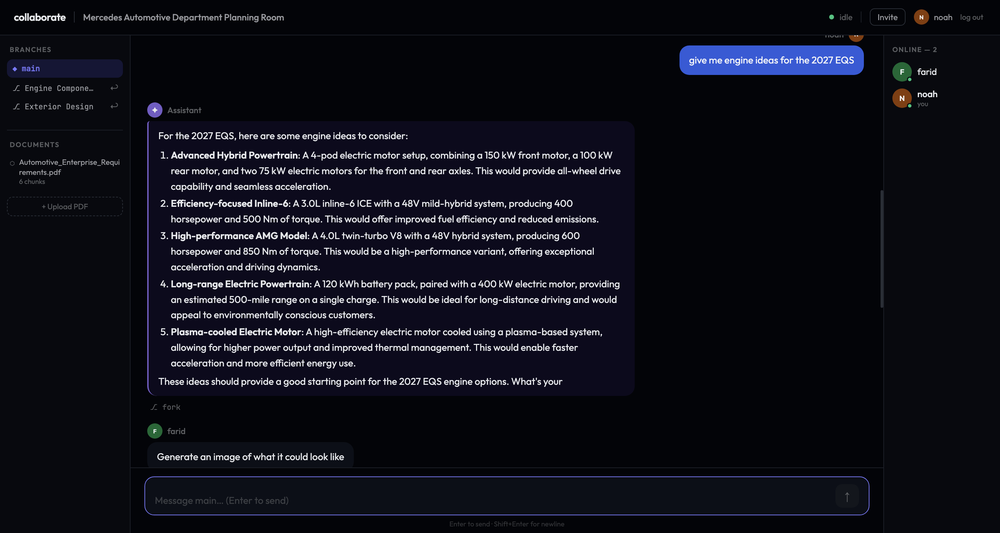

# LLM Collaboration Tool
<div align="center">
  <a href="https://llm-collaboration-tool.vercel.app/dashboard">
    
  </a>
  <p><i>Click to try the project yourself</i></p>

  [](https://react.dev/)
    [](https://www.typescriptlang.org/)
    [](https://vitejs.dev/)
    [](https://reactrouter.com/)
    [](https://socket.io/)
    [](https://fastapi.tiangolo.com/)
    [](https://www.sqlalchemy.org/)
    [](https://www.sqlite.org/)
    [](https://www.langchain.com/)
    [](https://huggingface.co/)
    [](https://www.docker.com/)
    [](https://render.com/)
    [](https://vercel.com/)
</div>

A multi-user AI-powered planning chatroom where teams brainstorm together with a shared LLM. Upload documents, fork conversation branches, and let the AI generate Mermaid diagrams and concept images — all in real time. View our presentation [here](https://youtu.be/93UVj6oZg1U?si=pSYZix1IBkPIgjsj)

## Features

- **Shared AI assistant** — one LLM responds to the whole room, streamed token-by-token to every connected user
- **Prompt queue** — when the LLM is busy, messages queue up; any team member can approve, edit, or discard before it sends
- **Git-style branching** — fork a private conversation from any message, explore an idea, then merge a summary back into main
- **RAG on your documents** — upload PDFs and the assistant answers using content from them (LangChain + ChromaDB)
- **Mermaid diagrams** — ask for a flowchart, sequence diagram, ER diagram, or class diagram and it renders inline
- **AI image generation** — ask for concept art, logos, or mood boards and an image is generated in the chat
- **User accounts** — register, log in, create rooms, and invite teammates via shareable links
- **Real-time sync** — all messages, branches, and queue actions sync instantly across all tabs via Socket.IO

## Tech Stack

| Layer | Tech |
|-------|------|
| Frontend | React 18, TypeScript, Vite, Socket.IO client |
| Backend | FastAPI, python-socketio, SQLAlchemy, SQLite |
| RAG | LangChain, ChromaDB, `BAAI/bge-small-en-v1.5` (HF Inference API) |
| LLM | Mistral/Llama via HF Inference API |
| Auth | JWT (python-jose), bcrypt |
| Deployment | Render (backend) + Vercel (frontend) |

## Neural Network Components

This project uses three pretrained neural network models, each with a distinct architecture. All weights are obtained from HuggingFace's Model Hub and accessed via the HuggingFace Inference API. No fine-tuning or local training was performed - the RAG pipeline provides domain-specific context, and the models' general capabilities handle the rest.

### 1. Embedding Model - BAAI/bge-small-en-v1.5

The embedding model is a transformer encoder trained with a contrastive learning objective. During training, the model sees pairs of texts that are semantically similar and pairs that are not. It learns to push similar texts closer together in vector space and dissimilar texts apart. The architecture uses self-attention layers with positional encoding to produce 384-dimensional dense vector representations from any text input.

Each chat message and uploaded document chunk is embedded and stored in ChromaDB. When a user sends a new message, it is embedded the same way, and cosine similarity is used to retrieve the top-5 most relevant past messages or document chunks.

- **Architecture:** Transformer encoder with self-attention and positional encoding
- **Training data:** NLI pairs and web-crawled text pairs (trained by BAAI)
- **Training objective:** Contrastive learning
- **Output:** 384-dimensional float32 vectors
- **Weights:** Pretrained, downloaded from HuggingFace Model Hub
- **Reference:** Xiao et al., "C-Pack: Packaged Resources To Advance General Chinese Embedding," 2023

### 2. Large Language Model - Meta Llama 3 8B Instruct

The LLM is a decoder-only transformer that generates text autoregressively, one token at a time. Unlike the encoder-based embedding model, each token can only attend to previous tokens (causal attention), which enables sequential generation. The architecture includes Grouped Query Attention (GQA), where multiple query heads share key-value pairs to reduce memory usage during inference without significantly hurting quality. It uses a 128K token vocabulary and 32 transformer layers.

The base model was pretrained by Meta on over 15 trillion tokens from publicly available sources using next-token prediction as the training objective. Meta disclosed that no user data was included in the training set. The instruct version was further aligned with supervised fine-tuning (SFT) and reinforcement learning from human feedback (RLHF) to follow instructions and produce helpful responses.

- **Architecture:** Decoder-only transformer, 32 layers, GQA, 128K vocabulary
- **Training data:** 15T+ tokens from publicly available sources (no Meta user data), 10M+ human-annotated examples for instruction tuning
- **Training objective:** Next-token prediction (pretraining), SFT + RLHF (alignment)
- **Weights:** Pretrained, downloaded from HuggingFace Model Hub
- **Reference:** Meta AI, "Introducing Meta Llama 3," April 2024; arXiv:2407.21783

### 3. Diffusion Model - Stable Diffusion XL

The diffusion model generates images from text prompts. It operates in three stages. First, a CLIP text encoder converts the text prompt into conditioning vectors that represent the desired image semantically. Second, a U-Net iteratively denoises a random latent tensor over multiple steps, guided by the CLIP conditioning vectors. The forward diffusion process (used during training) progressively adds Gaussian noise to images until they become pure noise; the U-Net learns to reverse this process. Third, a VAE decoder maps the final denoised latent representation back to pixel space, producing the output image.

The LLM decides when to trigger image generation based on the user's message. If the request would benefit from a visual (concept art, logo, mockup, mood board), the LLM includes a generation tag in its response, which the backend parses and sends to the diffusion model.

- **Architecture:** CLIP text encoder + U-Net denoiser (latent space) + VAE decoder (latent to pixels)
- **Training data:** LAION-5B dataset (5 billion image-text pairs)
- **Training objective:** Denoising - learn to reverse the progressive addition of Gaussian noise
- **Weights:** Pretrained, downloaded from HuggingFace Model Hub
- **Reference:** Rombach et al., "High-Resolution Image Synthesis with Latent Diffusion Models," CVPR 2022 (arXiv:2112.10752)

## Tensor Encoding and Data Flow

The application converts data to and from tensor representations at three points in the pipeline:

**Text to embeddings:** Raw chat messages are tokenized into subword tokens, then processed by the BGE transformer encoder to produce 384-dimensional float32 vectors. These vectors are stored in ChromaDB for cosine similarity retrieval. On query, the top-k vectors are matched and the corresponding original text is retrieved for prompt construction.

**Prompt to response:** The assembled prompt (system instructions + retrieved context + recent conversation history + user message) is tokenized into integer token IDs by the Llama 3 tokenizer using its 128K vocabulary. These IDs are processed through 32 transformer layers, producing logits (a probability distribution over the entire vocabulary) at each generation step. Tokens are sampled from these logits and streamed back to all connected users in real time via WebSocket.

**Text to image:** Image generation prompts are encoded by CLIP into conditioning vectors. A random latent tensor (Gaussian noise) is generated, and the U-Net iteratively denoises it over multiple diffusion steps, guided by the CLIP conditioning. The VAE decoder then converts the final latent tensor from latent space to pixel space, producing a PNG image that is saved and served to all users in the chat.

## End-to-End Pipeline

1. A user sends a message through the WebSocket connection
2. If the LLM is currently generating a response, the message enters the prompt queue for group review (approve, edit, or discard)
3. The message is embedded by BGE into a 384-dimensional vector
4. The vector is used to query ChromaDB for the top-5 most semantically similar past messages or document chunks
5. LangChain constructs the full prompt: system instructions + retrieved context + recent conversation history + user message
6. The prompt is sent to Llama 3, which streams response tokens back in real time
7. Each token is broadcast to all connected users via WebSocket
8. If the LLM's response contains an image generation tag, the description is sent to Stable Diffusion and the generated image is inserted into the chat
9. If the LLM's response contains a Mermaid code block, the frontend renders it as an inline diagram
10. The response and all embeddings are persisted to SQLite and ChromaDB respectively

## Getting Started

### Prerequisites

- Python 3.11+
- Node.js 18+
- A [Hugging Face](https://huggingface.co) account with an API token

### Backend

```bash
cd backend
python -m venv .venv && source .venv/bin/activate
pip install -r requirements.txt

# Create a .env file
cp .env.example .env   # then fill in your HF_TOKEN and SECRET_KEY

uvicorn main:socket_app --reload --port 8080
```

### Frontend

```bash
cd frontend
npm install

# Create a .env.local file
echo "VITE_SOCKET_URL=http://localhost:8080" > .env.local

npm run dev   # http://localhost:5173
```

### Docker (full stack)

```bash
# Copy and fill in your env vars
cp .env.example .env

docker compose up --build
```

Frontend → `http://localhost:5173` · Backend → `http://localhost:8080`

## Environment Variables

### Backend (`.env`)

| Variable | Description | Default |
|----------|-------------|---------|
| `HF_TOKEN` | Hugging Face API token | required |
| `SECRET_KEY` | JWT signing secret | `change-me-in-production` |
| `FRONTEND_URL` | Your frontend URL (used in invite links) | `http://localhost:5173` |
| `CORS_ORIGINS` | Allowed origins (JSON array) | `["http://localhost:5173"]` |
| `DATABASE_URL` | SQLite path | `sqlite+aiosqlite:///./collaborate.db` |

### Frontend (`.env.local`)

| Variable | Description |
|----------|-------------|
| `VITE_SOCKET_URL` | Backend URL | `http://localhost:8080` |

## Deployment

### Render (backend)

1. Create a new **Web Service** pointing to the `backend/` directory
2. Build command: `pip install -r requirements.txt`
3. Start command: `uvicorn main:socket_app --host 0.0.0.0 --port $PORT`
4. Add environment variables: `HF_TOKEN`, `SECRET_KEY`, `FRONTEND_URL`, `CORS_ORIGINS`

### Vercel (frontend)

1. Import the repo and set the **root directory** to `frontend/`
2. Add environment variable: `VITE_SOCKET_URL=https://your-backend.onrender.com`
3. Deploy — `vercel.json` handles SPA routing automatically

## Project Structure

```
├── backend/
│   ├── main.py              # FastAPI app + Socket.IO handlers
│   ├── core/
│   │   ├── auth.py          # JWT + password hashing
│   │   └── config.py        # Environment config
│   ├── models/
│   │   ├── database.py      # SQLAlchemy models
│   │   └── schemas.py       # Pydantic schemas
│   └── services/
│       ├── llm.py           # LLM inference
│       ├── rag.py           # LangChain RAG pipeline
│       ├── queue.py         # Prompt queue manager
│       └── branch.py        # Branch/merge logic
└── frontend/
    └── src/
        ├── components/      # ChatRoom, MessageBubble, MermaidDiagram, …
        ├── context/         # AuthContext, RoomContext
        ├── hooks/           # useWebSocket
        ├── pages/           # Login, Register, Dashboard, Room, Invite
        └── lib/             # api.ts (fetch wrapper)
```
